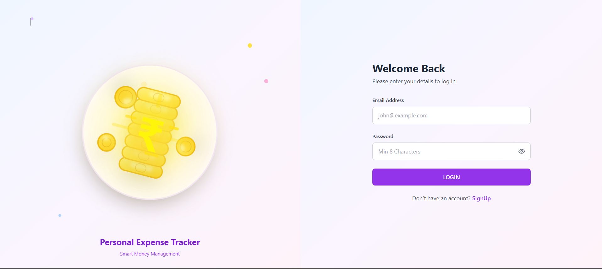

# Expense Tracker

A full-stack expense tracking application built with React and Node.js that helps users manage their income and expenses with real-time data visualization.

## Features

- 🔐 User Authentication (JWT-based)
- 📊 Interactive Dashboard with charts (Pie, Bar, Line)
- 💰 Income Management (Add, View, Delete, Export)
- 💳 Expense Management (Add, View, Delete, Export)
- 📈 Real-time Data Visualization
- 📱 Responsive Design
- 📥 Excel Export for Reports
- 🎨 Modern UI with Tailwind CSS

## login

## Tech Stack

### Frontend
- React 18
- React Router DOM
- Recharts (for data visualization)
- Axios
- Tailwind CSS v4
- Lucide React (icons)

### Backend
- Node.js
- Express
- MongoDB
- JWT Authentication
- ExcelJS (for report generation)
- bcrypt.js (password hashing)

## Getting Started

### Prerequisites
- Node.js (v14 or higher)
- MongoDB Atlas account (or local MongoDB)
- npm or yarn

### Installation


1. **Backend Setup**
   ```bash
   cd backend
   npm install
   ```

   The `.env` file is already configured with your MongoDB connection.

2. **Frontend Setup**
   ```bash
   cd ../frontend
   npm install
   ```

### Running the Application

1. **Start the Backend Server**
   ```bash
   cd backend
   npm start
   ```
   Server will run on http://localhost:5000

2. **Start the Frontend** (in a new terminal)
   ```bash
   cd frontend
   npm start
   ```
   Application will open on http://localhost:3000

## Project Structure

```
Expanse tracker/
├── backend/
│   ├── config/
│   │   └── database.js
│   ├── controllers/
│   │   ├── authController.js
│   │   ├── incomeController.js
│   │   ├── expenseController.js
│   │   └── dashboardController.js
│   ├── models/
│   │   ├── User.js
│   │   ├── Income.js
│   │   └── Expense.js
│   ├── routes/
│   │   ├── authRoutes.js
│   │   ├── incomeRoutes.js
│   │   ├── expenseRoutes.js
│   │   └── dashboardRoutes.js
│   ├── middleware/
│   │   └── auth.js
│   ├── .env
│   ├── package.json
│   └── server.js
└── frontend/
    ├── public/
    │   └── index.html
    ├── src/
    │   ├── components/
    │   │   ├── Layout.js
    │   │   ├── Sidebar.js
    │   │   └── ProtectedRoute.js
    │   ├── context/
    │   │   └── UserContext.js
    │   ├── pages/
    │   │   ├── Login.js
    │   │   ├── SignUp.js
    │   │   ├── Dashboard.js
    │   │   ├── Income.js
    │   │   └── Expense.js
    │   ├── utils/
    │   │   ├── apiPath.js
    │   │   └── axios.js
    │   ├── App.js
    │   ├── index.js
    │   └── index.css
    └── package.json
```

## API Endpoints

### Authentication
- `POST /api/auth/signup` - Register new user
- `POST /api/auth/login` - Login user
- `GET /api/auth/me` - Get user profile
- `PUT /api/auth/profile-image` - Update profile image

### Income
- `POST /api/income` - Add income
- `GET /api/income` - Get all income
- `DELETE /api/income/:id` - Delete income
- `GET /api/income/download` - Download income report (Excel)

### Expense
- `POST /api/expense` - Add expense
- `GET /api/expense` - Get all expenses
- `DELETE /api/expense/:id` - Delete expense
- `GET /api/expense/download` - Download expense report (Excel)

### Dashboard
- `GET /api/dashboard` - Get dashboard summary and analytics

## Features in Detail

### Dashboard
- Summary cards showing total balance, income, and expenses
- Recent transactions list
- Financial overview pie chart
- Last 30 days expenses bar chart
- Last 60 days income pie chart
- Categorized expenses and income sources

### Income Page
- Bar chart showing income trends
- Add new income with icon selection
- Income sources list with delete functionality
- Download income report as Excel

### Expense Page
- Line chart showing expense trends
- Add new expense with icon selection
- All expenses list with delete functionality
- Download expense report as Excel

## Usage

1. **Sign Up**: Create a new account with your email and password
2. **Login**: Access your account
3. **Dashboard**: View your financial overview
4. **Add Income**: Navigate to Income page and add your income sources
5. **Add Expenses**: Navigate to Expense page and track your spending
6. **Download Reports**: Export your data as Excel files for record-keeping

## Security Features

- Password hashing with bcrypt
- JWT-based authentication
- Protected API routes
- Automatic token validation
- Secure session management

## Contributing

Feel free to fork this project and submit pull requests for any improvements.

## License

MIT License
